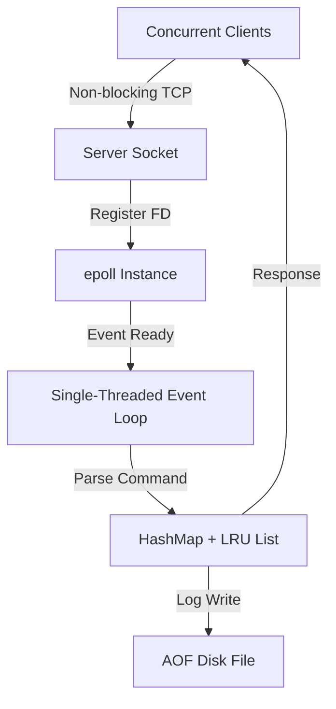

# AtomicKV


**Author:** Rajneesh Sharma  
**GitHub:** github.com/Rajneeshsharma125

---

AtomicKV is a high-performance, event-driven in-memory 
key-value store I built in C++ to deeply understand how 
production systems like Redis handle massive concurrency 
without the overhead of thread-per-client models.

The core idea: instead of spawning one thread per client 
(which causes context-switching at scale), a single thread 
monitors all connections using Linux epoll — waking up only 
when a socket is ready. This is how Redis and Nginx handle 
millions of connections efficiently.

---

## Why I Built This

During my studies of OS and systems programming, I kept 
asking: *how does Redis actually work under the hood?* 
Rather than just reading about it, I built a stripped-down 
version myself — implementing the event loop, memory 
management, and persistence layer from scratch in C++.

---

## Key Features

- **epoll Event Loop** — Single-threaded, non-blocking I/O
  handling thousands of concurrent connections without 
  context-switching overhead
- **O(1) LRU Eviction** — HashMap + Doubly Linked List 
  combination ensures both lookup and eviction happen in 
  constant time
- **TTL Expiry** — Keys expire lazily on access, eliminating
  background thread overhead for cleanup
- **AOF Persistence** — Every write is logged to disk so 
  data survives server restarts
- **Docker + AWS** — Containerized and deployed on EC2

---

## System Architecture

Instead of the traditional thread-per-client model, AtomicKV
uses a single-threaded event loop — the same pattern used by
Redis and Nginx.



**Request Flow:**
1. Client connects via TCP
2. epoll_wait detects socket is ready
3. Server reads and parses command (SET/GET/DEL)
4. HashMap updated, LRU list reorganized in O(1)
5. Write appended to AOF log
6. Response sent back to client

---

## Performance Benchmarks

I wrote a Python benchmarking suite using ThreadPoolExecutor
to stress test the server with concurrent connections.

**Test Setup:**
- 200 concurrent clients
- 200 SET + GET operations each
- 80,000 total requests
- Raw TCP sockets on native Linux

**Results:**

| Metric | Result |
|--------|--------|
| Total Requests | 80,000 |
| Time Taken | 8.04 seconds |
| Throughput | **~9,950 req/sec** |
| Avg Latency | **32.97ms** per SET+GET |

The epoll architecture handles nearly 10,000 operations/sec 
on a single thread — no thread pool, no context switching.

---

## How to Run

### Prerequisites
- g++ (C++17 support)
- Make
- Linux (epoll is Linux-only)
- Docker (optional)

### Build from Source
```bash
make
./nitredis_server
```

### Connect via Client
```bash
nc localhost 8081
```

### Supported Commands
```bash
SET <key> <value>           # Store a value
SET <key> <value> <ttl>     # Store with expiry (seconds)
GET <key>                   # Retrieve a value
DEL <key>                   # Delete a key
```

### Example Session
```bash
SET username rajneesh
OK

GET username
rajneesh

SET session_token abc123 30
OK

# After 30 seconds
GET session_token
NULL
```

---

## Docker Deployment

```bash
docker build -t atomickv .
docker run -d -p 8081:8081 atomickv
```

## AWS EC2 Deployment

1. Launch Ubuntu 22.04 EC2 instance
2. Allow TCP inbound on port 8081 in Security Group
3. Clone repo → run `make` → run `./nitredis_server`

---

## Project Structure

```
atomickv/
├── src/
│   ├── server.cpp      # epoll event loop + TCP handling
│   └── kv_store.cpp    # HashMap + LRU eviction logic
├── include/
│   └── kv_store.h      # Class definitions
├── Dockerfile
├── Makefile
└── ARCHITECTURE.md
```

---

## What I Learned

- How epoll solves the C10K problem at the OS level
- Why HashMap alone isn't enough for O(1) LRU — you need 
  the Doubly Linked List to track recency
- How AOF persistence works in production KV stores
- Non-blocking socket programming with POSIX APIs

---

## What I'd Improve Next

- Add KEYS command to list all stored keys
- Add replication (primary-replica setup)
- Add cluster mode with consistent hashing
- Implement RESP protocol for Redis client compatibility
```
